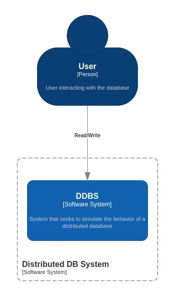
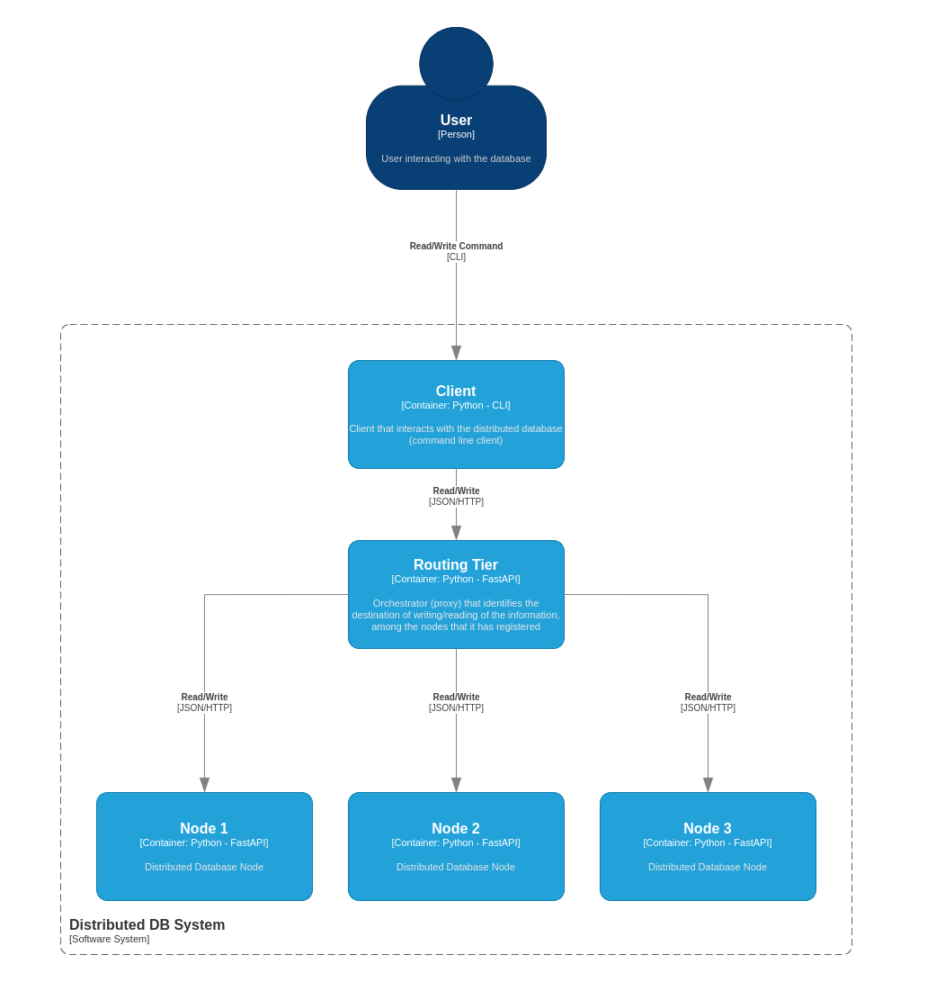

# ST0263 Tópicos Especiales en Telemática | Avance 2 del proyecto 1

# Table of contents
1. [Estudiantes](#estudiantes)
2. [Profesor](#profesor)
3. [Actividad](#actividad)
4. [Prerequisitos](#prerequisitos)
5. [Ambiente de desarrollos](#dev)
6. [Ambiente productivo](#prod)
7. [Referencias](#referencias)

## Estudiantes: <a name="estudiantes"></a>

- David Gomez Correa: dgomezc10@eafit.edu.co
- Pascual Gómez: pgomezl@eafit.edu.co
- Sebastian Granda: sgrandag@eafit.edu.co

## Profesor: <a name="profesor"></a>

- Edwin Nelson Montoya Munera: emontoya@eafit.edu.co

# DDBS (Distributed DB System) <a name="actividad"></a>

Proyecto 01 (Segunda entrega): simulación de una base de datos distribuida

## Descripción
Este avance contempla la creación de las siguientes partes:

- Nodo: encargado de la lectura y escritura de la información que reciba (en forma de llave valor). Segun el planteamiento, el unico que accedera a los nodos sera el Routing Tier
- Routing Tier: encargado de recibir las peticiones de un cliente, este obtiene la llave para poder encriptarla y, con esto, determinar el nodo que debe almacenar o solicitar. Tambien cuenta con monitoreo de salud de los nodos, para identificar cuando un nodo se cae o se vuelve a levantar y así poder actualizar capacidades y redistribuir en función de las nuevas capacidades.
- Cliente: este es el punto donde se conecta el usuario para interactuar con el sistema, si bien pueden existir diversos tipos de clientes, el alcance de este avance contempla un cliente CLI

## Diseño del sistema

### Contexto
</img>

### Contendores
</img>

## Prerequisitos: <a name="prerequisitos"></a>

- Es necesario tener instalado docker y docker compose (para las últimas versiones de docker, solo esto es suficiente ya que compose está integrado).

- Se recomienda tener instalado Python3.9 para poder manejar las dependencias dentro del editor de texto y usar funciones como la función de autocompletar.

## Ambiente de desarrollo <a name="dev"></a>

### ¿Como se ejecuta?

Antes de ejecutar es necesario contar con Docker Compose y Python instalados, se deben instalar las dependencias alojadas en el archivo `requirements.txt` o `Pipfile` del directorio CLI de clientes (`./clients/cli`) (se recomiendo el uso de `pipenv` para facilitar el manejo de entornos virtuales)

- Ejecutar `docker-compose up` o `docker compose up` (segun la versión) para levantar los nodos y el routing tier
- El cliente puede ser ejecutado en local o en la misma maquina donde de despliegue, basta con usar el comando `python ./clients/cli/main.py`

### Estructura de directorios
```
.
├── clients              // Directorio de clientes
├── db_nodes_data        // Directorio donde se almacenan las llaves de los nodods
├── docker-compose.yml   // Docker compose para levantar el proyecto
├── docs                 // Documentos y recursos
├── node_api             // Implementación de Nodos
├── README.md            // Este archivo
├── routing_tier_api     // Implementación del Routing Tier
└── up_node2.yml         // Docker compose para levantar el nodo 2 (para validar redistribución)
```
## Ambiente productivo <a name="prod"></a>

- Desarrollado en Python con FastAPI
- Librerias:
  - redis==4.3.4
  - uvicorn==0.18.2
  - Jinja2==3.1.2
  - fastapi==0.79.1
- Herramientas:
  - Supervisor

### ¿Como se ejecuta?
No es necesario levantar nada, ya que gracias a la herramienta de Supervisor se levanta todo el proyecto de manera automatica, esto ayuda a tomar el proyecto como un servicio, el cual se reiniciara en caso tal de que llegara a fallar para garantizar que va a estar disponible.

#### ¿Como acceder?
Tenga en cuenta que:

- URL: http://ec2-54-147-188-203.compute-1.amazonaws.com
- IP Elastica: 54.147.188.203
- Para acceder a la API, debe hacerlo a traves del puerto 8000 `http://ec2-54-147-188-203.compute-1.amazonaws.com:8000/`
- Para acceder a la documentación de los endpoints, acceda a `http://ec2-54-147-188-203.compute-1.amazonaws.com:8000/docs`
- Para acceder a los endpoint que interactuan con la base de datos, debe usar el prefijo `db/`
- El cliente cuenta por defecto con esta URL para conectarse a los servicios, pero puede ser modificada en cualquier momento

Si desea acceder a la instancia, use el comando `ssh -i "proyecto1.pem" ubuntu@ec2-54-147-188-203.compute-1.amazonaws.com`

Sin embargo, la forma de ejecutarlo de manera manual es muy similar al entorno de desarrollo

- Ejecutar `docker-compose up` o `docker compose up` (segun la versión) para levantar los nodos y el routing tier.
- El cliente puede ser ejecutado en local o en la misma maquina donde de despliegue, basta con usar el comando `python ./clients/cli/main.py`

## Referencias <a name="referencias"></a>

- [FastAPI](https://fastapi.tiangolo.com/)
- [Cookiecutter](https://github.com/sgg10/cookiecutter-fastapi)
- [Uvicorn](https://www.uvicorn.org/)